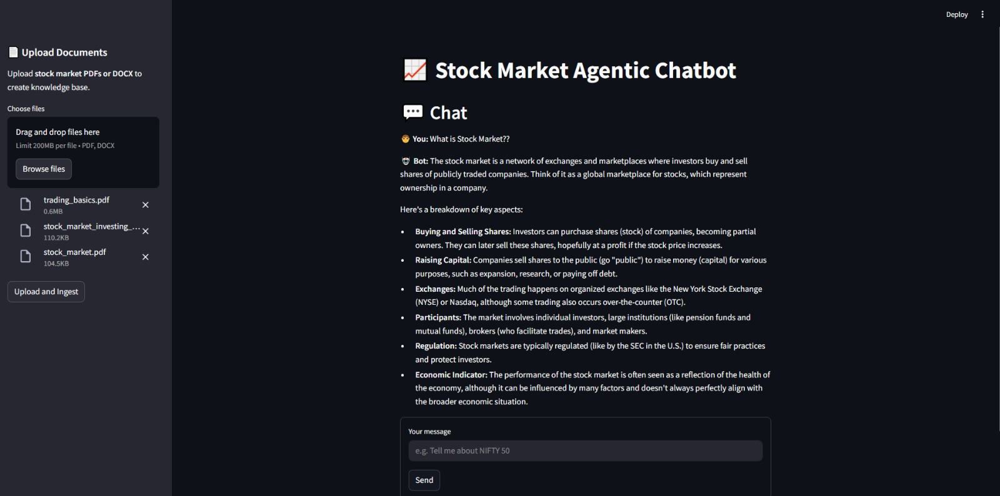

# **AGENTIC TRADING BOT**

## Overview

The Stock Market Agentic Chatbot is an advanced tool designed to provide users with accurate, real-time stock market data and insights. This chatbot leverages a powerful API to fetch live stock data, retrieve relevant news articles from the internet, and analyze market trends. It is a perfect assistant for investors, traders, and stock market enthusiasts.


## Key Features

1. **Real-Time Stock Market Data**
   Fetch live data for any listed stock, including current prices, volume, market cap, and other vital metrics.

2. **Document Analysis**
   Upload stock market-related documents, such as reports or research papers, and receive accurate, insightful summaries.

3. **News Aggregation**
   Automatically searches the internet for the latest stock market news and presents relevant articles for informed decision-making.

4. **Trend Analysis**
   Analyzes historical data and market trends to provide actionable insights.

5. **Custom Queries**
   Answer user queries related to stocks, indices, and market performance with tailored responses.

---

## Prerequisites

### Keys needs to be mention inside the .env
```
POLYGON_API_KEY
GOOGLE_API_KEY
TAVILY_API_KEY
GROQ_API_KEY
PINECONE_API_KEY
```

### For running the fastapi endpoint
```
uvicorn main:app --host 0.0.0.0 --port 8000 --reload
```

### For running the streamlit ui
```
streamlit run streamlit_ui.py
```

### For installing the requirements
```
pip install -r requirements.txt
```

### For creating the env
```
conda create -p env python=3.10 -y
```

### For activate the env through cmd
```
conda activate <env_path>
```

### For activate the env through git-bash
```
source activate ./env
```

---

## How It Works

1. **Upload Document**
   Users can upload any document related to the stock market. The chatbot will process and extract meaningful data to answer queries and provide insights.

2. **Real-Time Data Retrieval**
   Using a live stock market API, the chatbot fetches up-to-date market data and presents it in a user-friendly format.

3. **News Search**
   The chatbot scans online sources for the latest developments in the stock market and compiles relevant information.

4. **Interactive Query System**
   Engage in natural language conversations to get personalized answers and recommendations.

---

## **This is the Stock Market Agentic Chatbot**


#### You can upload files in side bar in the left


#### Press on Upload and Ingest to create the embeddings


#### This is the process in backend


#### File uploaded


#### Chating with chatbot




#### Backend process while chating


#### Example that chat-bot providing document accurate answers


---

## Usage

* **Interacting with the Bot**: Type queries in the chat interface to receive stock data or upload documents for analysis.
* **Custom Configurations**: Modify API keys and other settings in the `config.py` file.

---